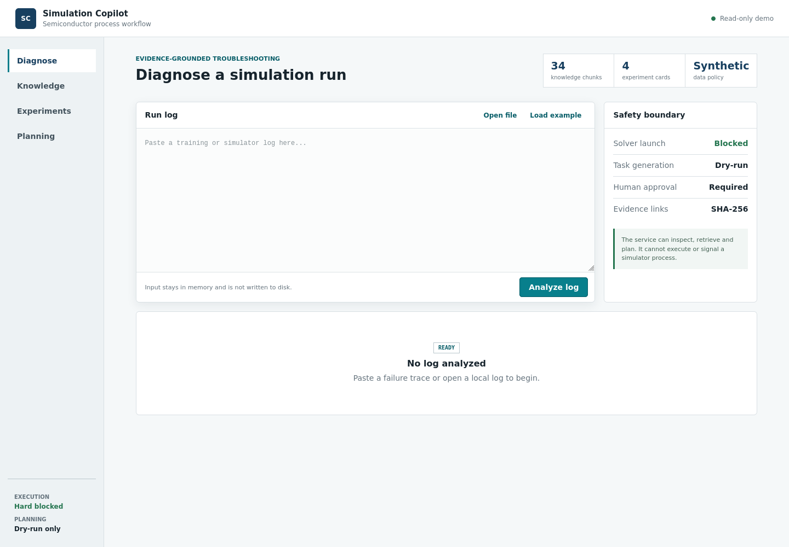
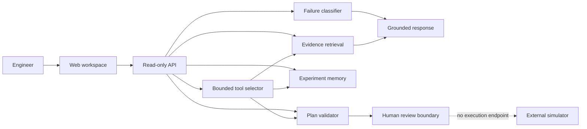

# Semiconductor Process Simulation Copilot

[](https://github.com/tianjing111/semiconductor-simulation-copilot/actions/workflows/tests.yml)

An evidence-grounded AI assistant for semiconductor simulation workflows. It
diagnoses run failures, retrieves source-linked technical evidence, organizes
experiment memory, and reviews dry-run simulation plans behind a strict human
approval boundary.

> Public portfolio edition: all bundled logs, metrics, configurations and plans
> are synthetic demonstrations.



## What it demonstrates

- **Grounded troubleshooting:** every diagnosis includes decisive log evidence,
  retrieved source paths and SHA-256 hashes.
- **Retrieval pipeline:** documentation, synthetic logs and project source are
  chunked into a compact searchable knowledge index.
- **Experiment memory:** structured result files become searchable experiment
  cards instead of disappearing into run directories.
- **Safety-constrained tool use:** plans are typed, budget checked and required
  to contain bottom-layer `--dry-run` enforcement.
- **Bounded workflow agent:** natural-language requests select one of five
  allowlisted tools while structured code retains parameter and permission
  control.
- **Optional LLM summaries:** an OpenAI-compatible endpoint may summarize frozen
  findings, but it cannot change actions or permissions.

## Evaluated RAG loop

The public knowledge assistant supports section-aware keyword, local TF-IDF
sparse-vector and hybrid retrieval. Answers return one of four explicit states:
`ANSWERED`, `CLARIFICATION_REQUIRED`, `INSUFFICIENT_EVIDENCE` or
`CONFLICTING_EVIDENCE`, together with file, section, chunk and SHA-256 citations.

The frozen synthetic benchmark contains 40 questions: 22 answerable, 8
ambiguous, 6 out of scope and 4 with deliberately conflicting evidence.

| Retrieval | Recall@5 | MRR |
| --- | ---: | ---: |
| Keyword | 0.846 | 0.629 |
| TF-IDF sparse vector | 1.000 | 0.912 |
| Hybrid | 0.962 | 0.859 |

Hybrid grounded answering reaches 1.000 status accuracy, citation support,
abstention accuracy and conflict detection on this small regression set. These
numbers validate the bundled contracts; they are not production or semantic-
embedding benchmarks. See [the protocol](benchmarks/rag/README.md) and
[generated report](benchmarks/rag/reports/REPORT.md).

## Bounded tool use

The Copilot exposes five tools: `search_docs`, `validate_config`,
`create_dry_run`, `inspect_run` and `summarize_results`. The planner may select
one tool, but it cannot create configuration values, shell strings or new
permissions. A model-selected configuration tool always receives the
structured context supplied by the application, never model-generated
arguments. Live simulator execution is absent from the registry.

A frozen 30-task synthetic regression set compares explicit fixed dispatch,
natural-language routing without retrieval and routing with grounded retrieval.

| Policy | Tool selection | Expected status | Citation support | Unsafe calls |
| --- | ---: | ---: | ---: | ---: |
| Fixed dispatch | 1.000 | 1.000 | 1.000 | 0 |
| Bounded router, no RAG | 1.000 | 0.800 | 0.833 | 0 |
| Bounded router + RAG | 1.000 | 1.000 | 1.000 | 0 |

Fixed dispatch receives the explicit task family and remains the strongest
baseline when intent is already structured. The numbers above are regression
results on bundled synthetic cases, not a live-LLM or production benchmark.
See [the tool-use protocol](benchmarks/agent/README.md) and
[generated report](benchmarks/agent/reports/REPORT.md).

## Architecture



The optional model is outside the safety-critical path. See
[docs/architecture.md](docs/architecture.md).

## Engineering decisions

| Decision | Rationale |
| --- | --- |
| Deterministic diagnostic core | Keeps failure classification testable and usable without an external model. |
| Optional LLM only for summaries | Prevents generated text from changing evidence, actions or permissions. |
| Source hashes on retrieved evidence | Makes every recommendation traceable to a specific public artifact. |
| No simulator execution endpoint | Keeps expensive or licensed tools behind explicit human approval. |
| Synthetic-only public examples | Demonstrates the contracts without exposing proprietary configurations or research data. |

## Quick start

Requires Python 3.11+ and no third-party packages.

```bash
git clone https://github.com/tianjing111/semiconductor-simulation-copilot.git
cd semiconductor-simulation-copilot
./run.sh
```

Open [http://127.0.0.1:8765](http://127.0.0.1:8765).
For a one-click walkthrough using the bundled synthetic failure trace, open
[http://127.0.0.1:8765/?demo=1](http://127.0.0.1:8765/?demo=1).
For the grounded RAG walkthrough, open
[http://127.0.0.1:8765/?rag=1](http://127.0.0.1:8765/?rag=1).
For the bounded tool-use walkthrough, open
[http://127.0.0.1:8765/?agent=1](http://127.0.0.1:8765/?agent=1).

Run the checks:

```bash
./scripts/check.sh
```

The step-by-step public release procedure is in
[docs/PUBLISHING.md](docs/PUBLISHING.md).

## Try the API

```bash
curl http://127.0.0.1:8765/api/status

curl -X POST http://127.0.0.1:8765/api/diagnose \
  -H 'Content-Type: application/json' \
  --data '{"text":"RuntimeError: No usable samples found for split test"}'

curl -X POST http://127.0.0.1:8765/api/ask \
  -H 'Content-Type: application/json' \
  --data '{"question":"What signed focus values are valid?","mode":"hybrid"}'

curl -X POST http://127.0.0.1:8765/api/agent \
  -H 'Content-Type: application/json' \
  --data '{"request":"Inspect the run status","context":{"run_id":"layout holdout"}}'
```

Or use the CLI:

```bash
PYTHONPATH=src python3 -m simulation_copilot.cli \
  diagnose examples/logs/checkpoint_failure.log

PYTHONPATH=src python3 -m simulation_copilot.cli \
  ask "What should I check after a No usable samples found error?"

PYTHONPATH=src python3 -m simulation_copilot.cli \
  agent "Summarize the result metrics" --run-id "runtime profile"
```

## Optional grounded generation

The default response composer is deterministic. To use an OpenAI-compatible
local or hosted endpoint:

```bash
COPILOT_LLM_BASE_URL=http://127.0.0.1:8000/v1 \
COPILOT_LLM_MODEL=your-model \
./run.sh
```

`COPILOT_LLM_API_KEY` is optional for local endpoints and must never be
committed. Endpoint failure automatically returns the deterministic response.

Optional model-based tool selection uses separate variables:

```bash
COPILOT_AGENT_LLM_BASE_URL=http://127.0.0.1:8000/v1 \
COPILOT_AGENT_LLM_MODEL=your-model \
./run.sh
```

The model selects only a registered tool name. Code still owns its arguments,
validation and execution boundary. The public benchmark uses the deterministic
router so it remains reproducible without an external service.

## Safety properties

- no simulator-launch route;
- no shell-command generation from retrieved text;
- no uploaded-log persistence;
- 2 MiB request limit;
- static path-traversal protection;
- source hashes on retrieved evidence;
- argument-array plans with mandatory `--dry-run`;
- synthetic data policy enforced by a release audit script.

## Project layout

```text
src/simulation_copilot/   diagnosis, retrieval, memory, planning and API
web/                      responsive operations interface
examples/                 synthetic logs, experiments, configs and plans
docs/                     architecture and public data policy
tests/                    unit and integration-style service tests
scripts/                  release audit and regression checks
benchmarks/rag/           frozen questions, protocol and generated reports
benchmarks/agent/         bounded tool-use tasks and generated reports
```

## Scope

This is an engineering portfolio project, not an autonomous process-control
system or a production root-cause model. The synthetic metrics illustrate data
contracts and UI behavior; they are not scientific or hardware benchmarks.

## License

[MIT](LICENSE)
