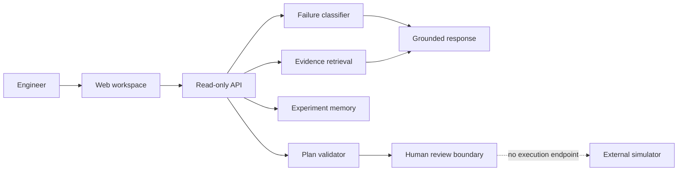

# Semiconductor Process Simulation Copilot

An evidence-grounded AI assistant for semiconductor simulation workflows. It
diagnoses run failures, retrieves source-linked technical evidence, organizes
experiment memory, and reviews dry-run simulation plans behind a strict human
approval boundary.

> Public portfolio edition: all bundled logs, metrics, configurations and plans
> are synthetic demonstrations.


## What it demonstrates

- **Grounded troubleshooting:** every diagnosis includes decisive log evidence,
  retrieved source paths and SHA-256 hashes.
- **Retrieval pipeline:** documentation, synthetic logs and project source are
  chunked into a compact searchable knowledge index.
- **Experiment memory:** structured result files become searchable experiment
  cards instead of disappearing into run directories.
- **Safety-constrained tool use:** plans are typed, budget checked and required
  to contain bottom-layer `--dry-run` enforcement.
- **Optional LLM summaries:** an OpenAI-compatible endpoint may summarize frozen
  findings, but it cannot change actions or permissions.

## Architecture



The optional model is outside the safety-critical path. See
[docs/architecture.md](docs/architecture.md).

## Quick start

Requires Python 3.11+ and no third-party packages.

```bash
git clone https://github.com/tianjing111/semiconductor-simulation-copilot.git
cd semiconductor-simulation-copilot
./run.sh
```

Open [http://127.0.0.1:8765](http://127.0.0.1:8765).
For a one-click walkthrough using the bundled synthetic failure trace, open
[http://127.0.0.1:8765/?demo=1](http://127.0.0.1:8765/?demo=1).

Run the checks:

```bash
./scripts/check.sh
```

The step-by-step public release procedure is in
[docs/PUBLISHING.md](docs/PUBLISHING.md).

## Try the API

```bash
curl http://127.0.0.1:8765/api/status

curl -X POST http://127.0.0.1:8765/api/diagnose \
  -H 'Content-Type: application/json' \
  --data '{"text":"RuntimeError: No usable samples found for split test"}'
```

Or use the CLI:

```bash
PYTHONPATH=src python3 -m simulation_copilot.cli \
  diagnose examples/logs/checkpoint_failure.log
```

## Optional grounded generation

The default response composer is deterministic. To use an OpenAI-compatible
local or hosted endpoint:

```bash
COPILOT_LLM_BASE_URL=http://127.0.0.1:8000/v1 \
COPILOT_LLM_MODEL=your-model \
./run.sh
```

`COPILOT_LLM_API_KEY` is optional for local endpoints and must never be
committed. Endpoint failure automatically returns the deterministic response.

## Safety properties

- no simulator-launch route;
- no shell-command generation from retrieved text;
- no uploaded-log persistence;
- 2 MiB request limit;
- static path-traversal protection;
- source hashes on retrieved evidence;
- argument-array plans with mandatory `--dry-run`;
- synthetic data policy enforced by a release audit script.

## Project layout

```text
src/simulation_copilot/   diagnosis, retrieval, memory, planning and API
web/                      responsive operations interface
examples/                 synthetic logs, experiments, configs and plans
docs/                     architecture and public data policy
tests/                    unit and integration-style service tests
scripts/                  release audit and regression checks
```

## Scope

This is an engineering portfolio project, not an autonomous process-control
system or a production root-cause model. The synthetic metrics illustrate data
contracts and UI behavior; they are not scientific or hardware benchmarks.

## License

[MIT](LICENSE)
